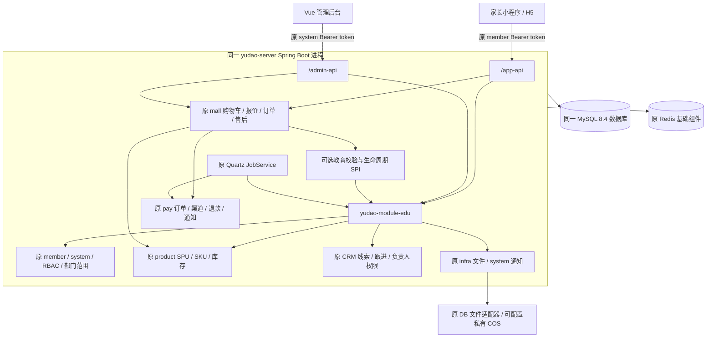
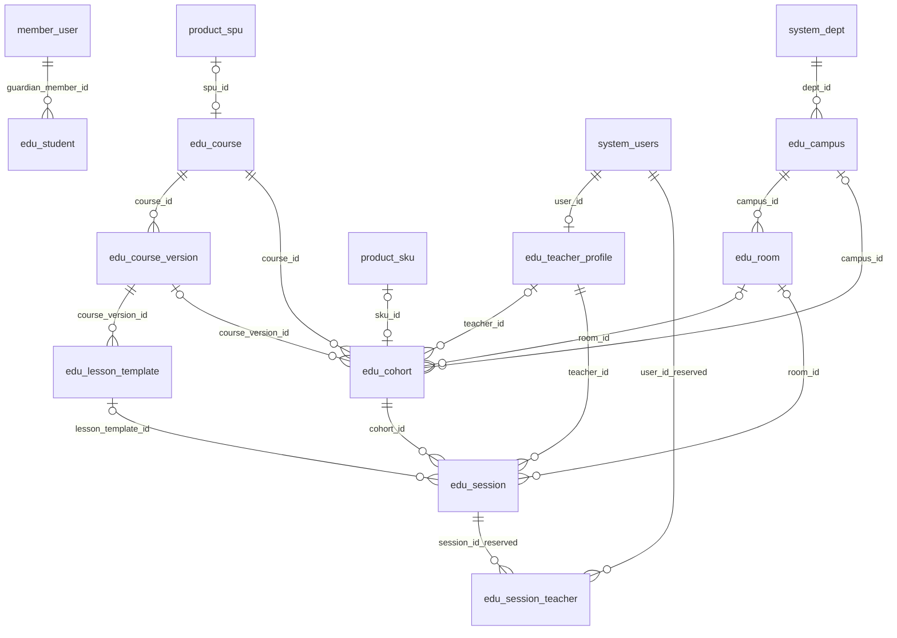
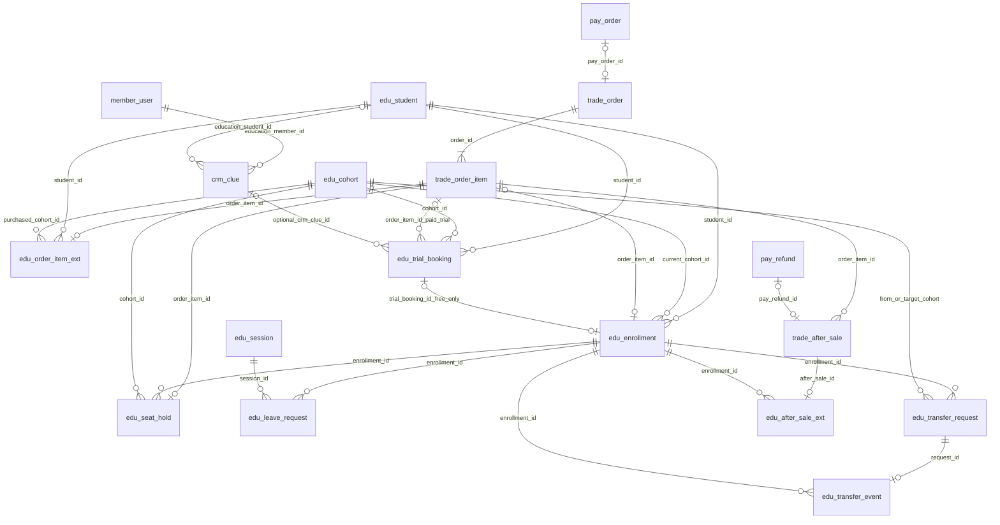
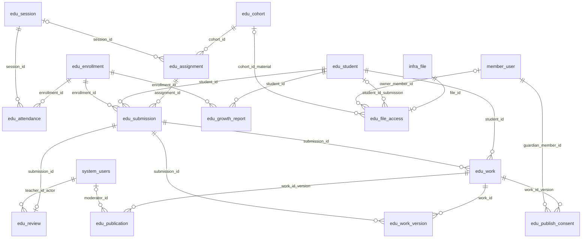
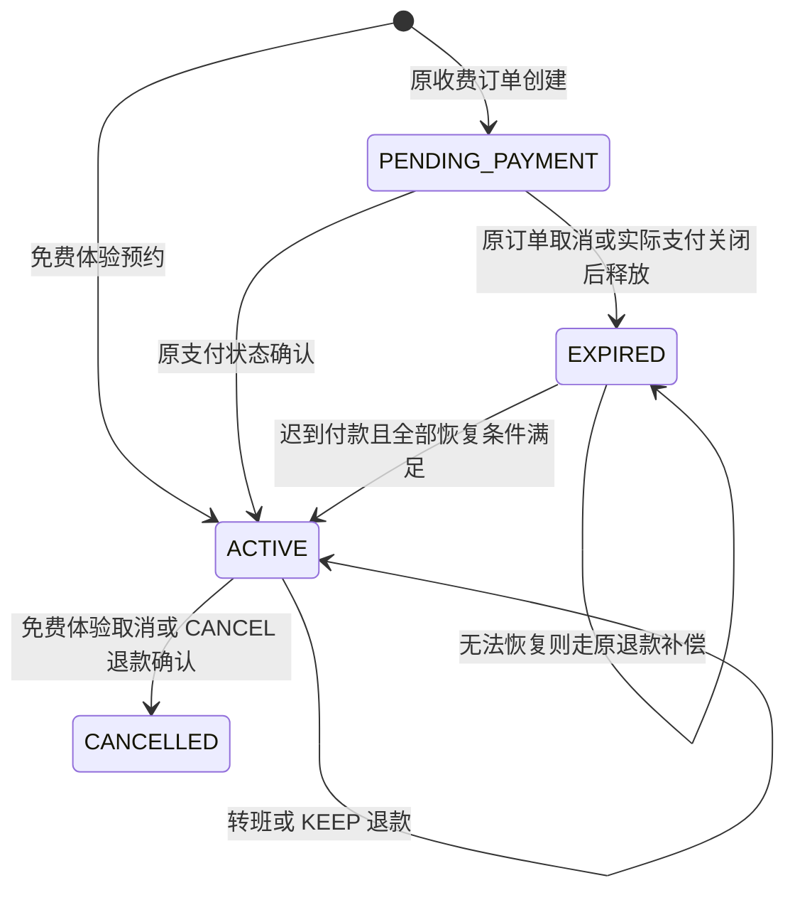

# VIBE CODING 架构与数据关系

本项目是固定上游 ruoyi-vue-pro 的模块化单体教育扩展：家长小程序/H5 和管理后台访问同一个 Spring Boot 服务，原业务表与 28 张教育表保存在同一 MySQL 数据库。教育模块保存课程、学员、排课和学习资格差异；原会员、员工/RBAC、商品库存、交易、支付、售后、文件和通知服务继续负责各自领域。

版本、公开源码与数据库来源见 [FOUNDATION.md](FOUNDATION.md)，启动、生产配置、任务和恢复流程见 [OPERATIONS.md](OPERATIONS.md)。本文描述当前源码结构；字段、类型、可空性、索引和 CHECK 的可再生成清单见 [DATA_DICTIONARY.md](DATA_DICTIONARY.md)。接口概览见 [API_CONTRACT.md](API_CONTRACT.md)，交易扩展详见 [TRADE_EDUCATION.md](TRADE_EDUCATION.md)。

## 运行边界与依赖方向

图中的 SPI 箭头表示运行时回调，不表示原 trade 对 edu 的编译依赖。教育模块依赖原 member/system/infra/trade，原 trade 定义可选 `TradeEducationPolicy`、`TradeEducationLifecyclePolicy` 并发现教育实现。报价、订单、支付与退款没有第二套教育 API 或金额账本。[EduPurchasePolicy](../apps/server/yudao-module-edu/src/main/java/cn/iocoder/yudao/module/edu/service/EduPurchasePolicy.java)、[EduTradeLifecycleService](../apps/server/yudao-module-edu/src/main/java/cn/iocoder/yudao/module/edu/service/EduTradeLifecycleService.java) 实现这些业务入口；[EduTradeOrderHandler](../apps/server/yudao-module-edu/src/main/java/cn/iocoder/yudao/module/edu/service/EduTradeOrderHandler.java) 接入原订单 handler。

| 原领域 | 教育复用方式 | 教育侧保存什么 |
| --- | --- | --- |
| member | 原会员注册/登录、token、支付人身份 | student.guardian_member_id 指向原 member_user；孩子没有独立登录体系 |
| system | 原员工、角色、菜单权限、部门数据范围、租户与通知 | teacher_profile.user_id 指向员工；campus.dept_id 指向原部门 |
| product | 原分类/品牌/属性、SPU/SKU 服务与库存增减 | course.spu_id、cohort.sku_id；班额用于配置，实际价格与可售库存读取原 SKU |
| trade | 原购物车、折扣/券/积分报价、订单项、售后与退款上限 | 原 cart/order_item 增加 student_id；教育保存购买快照和学习资格 |
| pay | 原支付单、支付扩展单、渠道状态确认、退款单和业务通知 | 教育仅维护资格/补偿状态，不把客户端“付款成功”当作财务依据 |
| infra 文件 | 原 FileService、文件元数据与实际存储适配器 | file_access 保存所有者/班期归属、用途、摘要 |
| CRM / infra 配置 | 原 CrmClueService、跟进/团队权限、ConfigService | 原 clue 增加家长/孩子/意向课程/联系授权字段；trial_booking.crm_clue_id 可选关联。品牌与首页设置使用原配置表和服务 |
| Quartz / 通知 | 原 JobService、QRTZ JDBC 表、原站内通知模板 | 教育维护 job 是原 JobHandler；没有第二个调度系统 |

[EduProductService](../apps/server/yudao-module-edu/src/main/java/cn/iocoder/yudao/module/edu/service/EduProductService.java) 创建班期时调用原商品服务建立稳定 SPU/SKU 关系；所有班期库存增减继续走原 ProductSkuApi。教育商品使用原 deliveryType=3 教学服务交付，排除物流地址和运费路径。普通商品仍按原流程运行。原 CRM 已加入活动运行组合，招生咨询继续使用原线索、跟进、负责人和权限模型；合同/回款 BPM 适配器通过可选 crm-bpm Maven profile 隔离，默认运行不含 Flowable。

招生入口由原 infra 配置选择受理员工；未配置时关闭受理。家长提交需明确当前联系授权、验证孩子归属，创建原 CRM clue 与 OWNER 权限，并可关联原有试课记录。家长结果不包含内部跟进备注。原 CRM 默认列表、详情、团队、跟进与负责人转移使用同一原权限边界，普通编辑不能改负责人；这些路径已通过 4 项 Java 边界测试与 8 项实际 API 检查。具体验收状态见 [实施差距收口](IMPLEMENTATION_GAPS.md)。

通知仍写入原 system_notify_message/template。[AppEduNotificationController](../apps/server/yudao-module-edu/src/main/java/cn/iocoder/yudao/module/edu/controller/app/AppEduNotificationController.java) 提供家长消息分页、未读数、已读和全部已读接口；收件人始终取原登录会员 ID 与 MEMBER 类型，不接受客户端指定其他人的身份。

[EduBrandService](../apps/server/yudao-module-edu/src/main/java/cn/iocoder/yudao/module/edu/service/EduBrandService.java) 限定可读写配置键并使用原 ConfigService；写入使用租户行锁与配置修订哈希阻止陈旧运营表单覆盖。公开目录按已发布 course_version 快照筛选，学习基础/时间/方式/校区条件使用匹配的实际班期，班期详情固定其课程版本。排课预览是只读冲突/受影响学员查询，最终保存仍执行带锁校验。

## 租户、身份与权限

当前是单品牌部署，只有原租户 1（VIBE CODING）启用；其他公开演示租户被停用。校区通过原部门映射，校区不是新的租户。所有教育 DO 继承原 `TenantBaseDO`，使用原 MyBatis 租户/逻辑删除机制，仍保留 tenant_id 为今后的明确租户部署提供隔离键。同一请求沿用原 Bearer token、tenant-id 和原 CommonResult；客户端提交孩子或班期编号并不构成授权。

[EduAccessService](../apps/server/yudao-module-edu/src/main/java/cn/iocoder/yudao/module/edu/service/EduAccessService.java) 执行教育资源判断：

- 家长必须拥有 `student.guardian_member_id`。读当前班期资料/课堂信息要求 ACTIVE 或 COMPLETED 资格；写作业要求 ACTIVE，写入前再次锁定资格并核对当前班期。
- 后台先检查原 `edu:<resource>:<action>` 权限，再按原全量数据范围、校区部门范围、班期教师或具体课次教师筛选资源。教师档案连接原员工账号。
- 学员后台可见性由其资格所关联的可访问班期推导。分页列表也过滤范围，不能只保护详情接口。
- 作业草稿详情不对后台教师开放，点评与成长报告只有发布后才进入家长读取结果。家长可读取自己的历史已提交点评/公开报告，不等于仍有当前班期写权限。

`cohort.teacher_id`、`session.teacher_id` 是教师档案编号；`review.teacher_id` 是执行点评的原员工编号。多员工关联表 `edu_session_teacher` 当前仅有 DO/Mapper，尚未参与服务层授权或排课，当前实际授课关系以班期/课次的单教师字段为准。

## ERD：逻辑关联

下列关联由应用服务维护，教育 DDL 没有物理 FOREIGN KEY。可空列和精确唯一键以数据字典为准；箭头不代表数据库自动级联删除。28 张教育表全部包含在三张图中，重复出现的节点表示跨领域连接。

### 课程与排课

课程主档保存草稿与修订号，发布新增 course_version 和该版本的 lesson_template。班期固定 course_version_id，发布检查课次数量、模板归属与顺序、教师、场地/私有课堂信息、未来时间、价格和条款。正式班课表与课纲一致；体验班必须为一课次。购买快照和固定课纲版本不会因随后编辑课程主档而被改写。

### 订单、学习资格与售后

每个孩子/订单项独立保留身份，两个孩子买同一 SKU 不合并订单行；库存与优惠仍在原引擎中按需要汇总。ORDER 资格只填写 order_item_id，FREE_TRIAL 资格只填写 trial_booking_id，两者由 CHECK 互斥。收费体验课仍是 ORDER 来源，其体验预约用 trial_booking.order_item_id 回联。转班修改 current_cohort_id 并记录 transfer_event，purchased_cohort_id 与原购买快照保持历史值。

### 学习记录、文件与作品

附件数组存 fileId/name，file_access 连接原文件元数据；数组中的引用关系不是外键。作品、作品版本、授权、审核记录按同一 work_id/version 关联。当前作品创建保存版本 1；版本表不意味着已经实现通用作品编辑器或任意版本发布流程。

## 状态与事务模型

原交易创建事务内，教育校验确认家长/孩子、课程版本、班期、课表冲突和报名情况；原 SKU 扣库存，原订单/订单项建立，教育快照、PENDING_PAYMENT 资格和占位状态同步落库。课程报价仍由服务端计算；创建请求的 expectedPayPrice 只确认家长看到的总价，服务端重新计算后不一致即要求刷新。

COMPLETED 是当前权限、报名去重和部分退款判断识别的状态；尚无自动结课任务，不在图中绘制已实现的自动转移。

| 场景 | 当前一致性措施 |
| --- | --- |
| 同孩子重复报名、同 SKU 最后名额 | 创建时锁定孩子/班期并用当前读取复核；活动资格派生唯一键；原 SKU 原子库存更新。批量孩子/班期锁按排序取得。 |
| 教师/教室/班期时间冲突 | 锁定相应资源和班期后使用 `FOR UPDATE` 读取冲突课次；避免 MySQL REPEATABLE READ 中早先快照漏掉刚提交的课次。 |
| 跨班期学员课表冲突 | 孩子锁串行化报名操作，当前读取相关资格和课次；交叉时间按实际课表判断，不只比较班期起止日期。 |
| 转班 | 锁孩子、资格、申请和排序后的两个班期；复核同课程/类型/发布版本/价格/课次结构、未开课且无处理中售后；目标扣原库存、原班恢复库存、更新资格指针和事件同事务。 |
| 并发售后、部分退款 | 原订单项及历史售后当前锁定读取；原引擎控制已退/在退金额；edu_after_sale_ext 仅记录 KEEP/CANCEL 和资格版本。 |
| 退款改变资格 | 只有原退款确认后执行。KEEP 保留资格/库存；CANCEL 核对资格版本并释放当前班期库存一次，以 stock_released 防重复。 |
| 草稿/点评/出勤 | 学员草稿与教师点评分别用 revision 检查陈旧编辑；点评锁 submission 后以当前读加载 review，首次保存也只能一个版本成功，返回持久化 updateTime；提交/出勤锁资格后复核状态和当前班期；点名簿按 sessionId 读取记录。已发布点评不可覆盖，重交形成新 submission 版本。 |
| 作品授权与撤回 | 作品行锁串行化授权/审核/发布；公开读取每次核对当前版本的作品状态、授权 GRANTED、publication PUBLISHED；撤回立即撤销公开可见性。 |

version/revision 是各服务显式使用的业务字段，并非所有 DO 都启用了统一 @Version 乐观锁。数据库事务覆盖同库操作；外部支付渠道和存储不与 MySQL 组成分布式原子事务，失败恢复依赖原支付状态确认、持久化状态和重试。

占位创建记录 expires_at（当前加 15 分钟）。[EduTradeMaintenanceJob](../apps/server/yudao-module-edu/src/main/java/cn/iocoder/yudao/module/edu/service/EduTradeMaintenanceJob.java) 先调用原支付过期检查；只有原支付确已关闭/不存在时才调用原订单取消，不能仅因教育时间戳到期就释放仍在支付中的订单。迟到支付只有原单允许恢复、无优惠券/积分等已返还权益、孩子/班期仍满足条件且可重新扣足原库存时才恢复；否则将 hold 标记 REFUND_PENDING，调用原退款服务。原退款确认后为 REFUNDED；渠道明确拒绝记 REFUND_FAILED 并留待人工核实。

维护任务与原 payNotifyJob/payRefundSyncJob/payOrderSyncJob 共用原 Quartz JDBC/JobService。注册、重试、故障检查及实际验证脚本见 [OPERATIONS.md](OPERATIONS.md)，不另外维护教育支付定时器。

## 私有文件代理语义

当前上传入口是 `POST /app-api/edu/file/upload`（studentId + MultipartFile）和 `POST /admin-api/edu/file/upload`（cohortId + MultipartFile）。[EduFileService](../apps/server/yudao-module-edu/src/main/java/cn/iocoder/yudao/module/edu/service/EduFileService.java) 通过原 FileService 创建 `edu-private/<tenant>/...` 路径，再建立 file_access；原 infra 负责字节、文件元数据与 DB/COS 适配器。家长上传检查所有权、文件名、扩展名及 30MB 上限；服务端把源码/HTML 等作为下载附件处理。

`GET /edu/file/get-url` 返回同应用 `/edu/file/content` URL、所需 Authorization/tenant-id headers 和 `expiresIn: 0`。这表示每次下载重新验证原登录会话与业务权限的代理地址，**不是短期 COS 签名 URL，也不是一次性下载 token**；Bearer token 不进入 URL。

下载规则按资料类别区分：

- 班期资料：后台需要对应权限与班期范围，家长需要指定孩子且具备该班期可读资格。
- 家长作业附件：家长需同时匹配孩子所有权和 owner_member_id。所有员工（包含全量数据范围管理员）均需在可访问班期中找到引用该文件的非 DRAFT 作业；私人草稿引用不授予员工读取权限。

content 响应设置 `Cache-Control: private, no-store`、`X-Content-Type-Options: nosniff` 和 attachment 下载头。原通用文件接口增加对 edu-private 路径的保护，防止从公开上传/元数据/下载路径绕过教育授权。对应控制器：[AppEduFileController](../apps/server/yudao-module-edu/src/main/java/cn/iocoder/yudao/module/edu/controller/app/AppEduFileController.java)、[AdminEduFileController](../apps/server/yudao-module-edu/src/main/java/cn/iocoder/yudao/module/edu/controller/admin/AdminEduFileController.java)。生产私有桶、可信代理和文件恢复配置见 [OPERATIONS.md](OPERATIONS.md)。

作品公开另走版本范围代理：[AppEduWorkFileController](../apps/server/yudao-module-edu/src/main/java/cn/iocoder/yudao/module/edu/controller/app/AppEduWorkFileController.java) 提供 preview-file/public-file。家长预览先验证作品所有权和明确版本；公开访问每次核对当前版本授权/审核/发布状态。附件只能通过该快照内部的序号解析，客户端不能提交任意原 fileId。服务核对归属与摘要、读取原字节后再次核对授权；返回附件下载并设置 CSP sandbox/default-src 'none'，撤回后不再可读。公开详情返回已审核版本正文与附件 index/name，公开列表只返回展示元数据；均不暴露孩子 ID、原 fileId 或底层私有存储 URL。

## 当前生产边界

1. 本地 MySQL schema 的原业务部分由固定公开 DO 和公开测试类型提示重建，未取得受限商城 SQL，也未声称复原官方全部约束/历史迁移。教育表的索引/检查约束是当前 DDL 的实际集合，不应把逻辑 ERD 当成物理外键保证。
2. 本地支付使用原 MockPayClient，唯一 foundation profile 加显式开关才注册；真实微信登录、商户支付/退款、渠道证书与回调、微信域名/审核和设备验收属于上线配置工作。测试结论与剩余外部验收见运行及验收文档。
3. 私有文件通过授权代理读取，尚未实现直接向教育客户端发放 COS 短期签名下载、恶意文件扫描或隔离执行沙箱。当前读取/上传会把文件内容加载进应用内存；公开作品提供审核版本正文和附件下载，不执行学员源码。响应上的 CSP 限制不等于已经提供代码运行沙箱。
4. 多个教育查询在取出记录后做 Java 范围过滤与分页，当前面向有限规模的本地验证。规模化前需要基于实际查询、数据范围与索引做 SQL 分页/性能验证；不能从单次本地验收推断生产吞吐量。
5. 多教师关联、自动结课、通用作品版本编辑等仅有部分模型/读取语义，不能等同完整业务能力。原 CRM 招生服务已启用，BPM 审批未启用；课程内容、师资、班期条款、退改方案和联系方式仍需机构审定。

生产 schema 使用独立 [Liquibase 迁移包](../infra/migration/README.md)，复用原 DATABASECHANGELOG / DATABASECHANGELOGLOCK 管理变更；其初始包排除开发会员、课程、交易、mock 和调度任务。现有开发初始化器仍只用于本地开发，不用于生产。真实目标部署、机构配置和外部渠道验收另行执行。
6. 已执行的独立 MySQL 逻辑备份恢复不等于 MySQL、Redis、COS 与真实支付回调的整栈灾备演练。保留原业务表、文件内容、QRTZ 状态和密钥恢复途径，具体流程见运行手册。

前端组织和构建说明见 [MINIAPP.md](MINIAPP.md)、[ADMIN.md](ADMIN.md)。本文件不替代这些专项文档，也不把尚未完成的外部验收表述为已部署能力。
