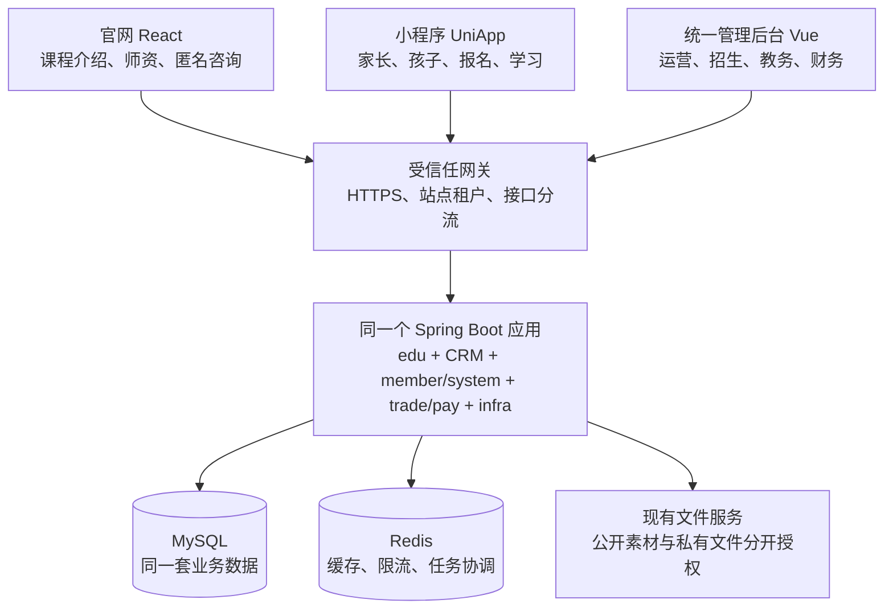

# 官网与小程序后端统一设计

日期：2026-09-14。状态：已在 codex/unified-backend 实施并完成隔离验收，未部署生产。本文保留方案推导；实际官网路由适配与交付结果见实施计划及 docs/UNIFIED_BACKEND.md。

用户最新范围约束：**视觉不动，主要改后端与数据库统一；官网管理后台也必须迁移。** 以当前运行、用户已确认的官网为展示基线，保留页面结构、样式、图片、品牌文案、轮播和操作流程。前端仅做连接统一后端所必需的接口、字段及真实请求状态适配。官网管理后台的现有能力完整迁入统一后台，保留熟悉的字段、操作和可达入口，沿用现有管理端组件，不以统一为由删掉功能。本约束优先于下文可能被理解为页面重构或取消官网管理功能的表述。

## 1. 结论与已确认条件

以 `codex/vibe-edu` 的小程序后端、数据库和管理后台为主，官网保留独立 React 前端，通过同一后端读取课程、师资、品牌配置，匿名咨询进入同一 CRM。统一业务数据和管理入口，继续区分匿名访客、登录家长和员工权限。

用户已确认：官网没有需要保留的真实业务数据，主要是演示、测试数据。因此不建设官网历史数据迁移、旧账号迁移或双库同步。小程序已有数据不在清理范围内，实施前仍需确认其运行环境并备份。

本次只检查网站仓库 `1229800890wzx-png/vibe-coding-studio`，毕业论文仓库不参与。

核查版本：

| 对象 | 版本 | 本地证据位置 |
|---|---|---|
| 原官网 | `master`，`d7e61210e6d874a683acd5898f28a8577dc79232` | `C:/Users/12298/Documents/ChatGPT/少儿vibe coding` |
| 官网朋友 PR #1 | `51e7984866baecdc50a1783de1231ac701af93ec`；核查时仍 OPEN | `C:/Users/12298/Documents/ChatGPT/少儿vibe coding/output/pr-review-1` |
| 小程序及完整业务后端 | `codex/vibe-edu`，`9e67e2eda71f0d9b67c6f01d9052ec28550c64cc` | `C:/Users/12298/.codex/worktrees/vibe-edu` |

官网 PR 与小程序锁定了相同的 ruoyi-vue-pro 后端版本 `8e43004cf68a405cd3485f98f8a539b97ca6544a` 和 Vue 管理后台版本 `aab14fb0e74720dd09e964ae066f8bbde9f9012e`。基础框架无需重写，业务定制的存放方式和模型却不同，不能整目录覆盖。

这份设计依据源码，不等于已经验证线上数据库、真实支付、微信配置或生产流量。没有在本次规划中运行数据库迁移或业务测试。

## 2. 方案选择

| 方案 | 成本与问题 | 决策 |
|---|---|---|
| 小程序后端为主，官网接入现有教育与 CRM 模块 | 复用身份、课程版本、班期、订单、教务和管理权限；补官网公开入口与前端适配 | 推荐 |
| 官网简化后端为主，再搬入小程序能力 | 官网只有简化课程、咨询管理，需要重新引入大量已有业务关系 | 不选 |
| 两套后端持续运行并同步课程、咨询 | 两份写入口、状态冲突、重复维护和故障恢复成本长期存在 | 不作为目标架构 |

建议后续从小程序分支建立 `codex/unified-backend`，将当前运行、用户已确认的官网前端原样保留为展示基线。官网 PR 仅参考必要的接口与表单数据处理，不整页移入、不因切换分支切换主题。小程序分支里的根目录官网仍接近原版，不能以为切到该分支就已经包含当前官网。

## 3. 最终架构

“同一套”以每个环境为单位：开发、测试、生产各自隔离。官网、小程序、管理后台可以分别部署和升级，使用同一业务 API；无需合并 React 与 Vue 的组件或包管理锁文件。

沿用小程序当前技术基础：JDK 21 构建/运行，Java 源码目标 17，Spring Boot 3.5.15，MySQL 8.4，Redis 7.4，Liquibase OSS 4.33.0。此次整合不叠加框架升级。

## 4. 重复能力及归并方式

| 能力 | 官网 PR 现状 | 小程序后端现状 | 统一方式 |
|---|---|---|---|
| 后端框架 | Yudao 的 infra overlay 中增加 education 服务 | 已有完整 server 及独立 edu 模块 | 保留 `apps/server`，停止引入旧 overlay |
| 管理后台与登录 | 单独 education 管理页、宽权限 `education:manage` | 原员工账号、角色、菜单及数据权限 | 官网管理功能完整迁入 `apps/admin`，提供官网管理菜单；共用员工登录和权限 |
| 课程 | 三个服务介绍，字符串 ID、stage、自由文本大纲 | 数字 ID、发布快照、等级/方向、课次与班期 | 正式教学课程共用原教育模块；服务介绍编辑迁入官网内容模块，不混成正式课程 |
| 课程价格与名额 | 没有完整交易关联 | 课程关联 SPU、班期关联 SKU，原商品/交易服务维护价格库存 | 直接读取；不复制价格或剩余名额字段 |
| 家长咨询 | 匿名表单写 `edu_inquiry`，单备注、三种状态 | 登录家长咨询写原 `crm_clue`，已有跟进与负责人权限 | 新匿名接入层也写 CRM；旧咨询表不引入 |
| 咨询跟进 | 更新状态及单条内部备注 | `crm_follow_up_record`、团队权限、转交 | 状态/备注在 CRM 教育扩展中保留并审计；实际联系继续用原跟进机制 |
| 家长和孩子 | 官网没有学习身份体系 | `member_user` 与孩子/监护关系 | 保留；匿名浏览咨询无需注册 |
| 导师 | 静态人物与展示文案 | 已发布导师公开接口与员工关联 | 后端能力共用；本期不自动用小程序资料替换官网头像/介绍，后续内容接入仍沿用原版式 |
| 品牌信息 | 前端静态配置 | 固定品牌字段和带 revision 的设置页 | 统一配置能力；本期保留当前官网品牌值和轮播，不自动覆盖为小程序默认内容 |
| 作品 | 静态/局部交互演示 | 真实作业作品、版本、家长授权、审核、发布和撤回 | 演示继续前端保留；真实作品按已有授权链单独接入 |
| FAQ、教学方法 | 静态文案 | 未发现对应完整 CMS 接口 | 第一阶段保留静态；确需运营编辑再加轻量内容配置 |
| 支付、报名、退费 | 没有完整实现 | 原 trade/pay 加教育报名与履约衔接 | 保留小程序链路；第一阶段官网不另建收银台 |
| 排课、作业、点评、成长 | 官网无对应能力 | 教育业务模块已有实现 | 留在原模块，无需合并重写 |
| 文件、缓存、任务、部署 | 独立脚本和本地服务配置 | 已有 infra、Redis、Quartz、迁移和备份工具 | 沿用小程序工具，增加官网构建和代理配置 |

这里的“已有实现”指源码存在，不表示所有外部服务已在生产环境开通。

### 4.1 官网管理后台的功能迁移

官网后台是本期明确交付物。迁移的是管理页面、菜单、接口、权限和可编辑内容能力；官网没有真实咨询数据，只省去旧业务记录迁移，不代表省去管理功能。

| 官网已有管理能力 | 统一后台中的承接方式 | 功能保持要求 |
|---|---|---|
| 课程/服务介绍列表、新建、编辑 | 官网管理下的课程展示管理；具体教学课程复用原教育课程模块 | 原标题、介绍、阶段、封面、大纲等可编辑字段不能丢失 |
| 展示排序、发布/隐藏 | 官网展示配置与原正式课程发布分别控制 | 保留官网排序与可见性控制；隐藏官网卡片不影响已有班期、报名和学习 |
| 咨询列表与联系方式 | 官网管理下的咨询管理，调用同一 CRM 查询服务 | 能看到全部本人有权限的官网来源咨询，支持匿名手机/邮箱 |
| new/contacted/closed 状态 | CRM 教育扩展中的官网处理状态 | 保留待联系、已联系、已关闭操作，关闭不等于转客户、删除或预约取消 |
| 咨询备注 | CRM 教育扩展中的独立内部备注字段 | 保留编辑及保存操作，记录操作人和时间；不覆盖家长原留言，也不伪造联系方式或下次联系时间 |
| 管理菜单与权限 | 统一员工账号、官网运营/招生角色及原 CRM 数据权限 | 旧管理入口有可达承接页，原功能逐项验收后才下线旧服务 |

官网服务介绍与真实课程分开建模：在统一数据库新增轻量官网展示配置（建议 `edu_website_offering`，具体字段见实施任务），保存 slug、展示标题/说明、阶段、素材引用、展示大纲、排序、可见性及可选真实 courseId。这类数据是官网内容，不复制正式课程的课次、版本、价格或库存。已有正式课程继续以 `edu_course` 为唯一业务来源；不能为了避免内容配置表而删除原后台的编辑/排序能力。

旧后台实际是“课程管理 / 咨询跟进”双标签页及编辑弹窗，迁入后保留其操作组织。旧课程标题上限 80、简介 600、大纲 2000，封面为原三种素材、排序 0–999、创建后标识锁定；旧咨询没有搜索/筛选控件，具备刷新、详情和状态/备注保存。来源预筛选属于新数据适配，不能误称旧功能。现有 infra_config.value 仅 500 字且品牌服务只接收固定 key，不能用它直接存完整课程介绍。

拟新增公开官网展示读取接口 `/app-api/edu/website-offering/list`，仅返回已发布的官网内容、按原 sortOrder/slug 排序。统一管理后台使用 `/admin-api/edu/website-offering/*` 的受限 CRUD/发布操作；这里的新增接口替换旧后台数据落点，官网继续原组件和原路径。实际课程关联后仍由原教育服务提供正式课程数据。

初始化时将用户确认的当前网站展示配置原样带入新内容模块，确保迁移后视觉一致；不导入旧测试咨询、默认账号或把演示介绍当作真实教学课程。首次切换必须验证后台保存内容后，原官网页面正确读取和呈现。

## 5. 课程与页面适配

### 5.1 同名表不能直接合并

| 官网模型 | 小程序模型 | 处理 |
|---|---|---|
| `edu_course.id VARCHAR(40)`：start/create/grow | `edu_course.id BIGINT` | 不导入；原三个路径保留为服务方向页 |
| `title` | `name` | API 适配为页面标题 |
| `image`：minecraft 等本地素材键 | `cover_url` / JSON `coverUrl` | 增加字段兼容能力；现有服务方向和演示图片原样保留，真实课程封面按已确认关联读取，不自动换图 |
| `stage=1/2/3` | `level`、`direction` | 不自动对应；保留现有筛选标签与控件，仅在适配层处理有明确依据的关联 |
| 自由文本 `outline` | 结构化 lessons 与发布课次模板 | 展示公开大纲，不能用每行文案生成正式课次 |
| `published` | 状态、revision、version、不可变发布快照 | 继续由正式发布动作产生公开版本 |
| `sort_order` | 当前列表主要按 ID 倒序 | 原排序能力迁入官网展示配置；正式课程目录维持自身业务排序 |

旧“创意启蒙、AI 项目创作、作品成长计划”是服务方向，不一定对应某一门实际课程。保留现有介绍、路径和咨询入口，只有确认关联后才传递具体 courseId。具体课程页面沿用当前路由和组件，由接口适配层解析关联；本期不为合并后端新增页面或改导航。未来如需新增课程详情 URL 或 SEO slug，再单独安排，不把可变课程 code 当永久网址。

### 5.2 直接复用的公开接口

以下均已经存在，响应采用 `{code,msg,data}`，仍需正确租户上下文。

| 路径 | 数据用途 | 官网改动 |
|---|---|---|
| `GET /app-api/edu/config/get` | 品牌固定字段 | 保留共享读取能力，当前官网品牌内容不自动替换 |
| `GET /app-api/edu/course/page` | `{list,total}`；默认 20、最多 100 条/页 | 适配层保证读取完整与筛选正确，不新增分页布局 |
| `GET /app-api/edu/course/get?id=` | 已发布课程详情 | 详情独立请求，支持第二页课程直接访问 |
| `GET /app-api/edu/cohort/list`、`cohort/get` | 班期 | 页面需要时接入，金额按分转元 |
| `GET /app-api/edu/campus/list` | 公开校区 | 按真实数据展示 |
| `GET /app-api/edu/teacher/list` | 已发布导师 | 保留公共接口，本期不自动替换官网头像/简介；内部员工字段不公开 |
| `GET /app-api/edu/work/public-page`、`public-get`、`public-file` | 已授权发布作品及附件 | 授权范围覆盖官网后再启用真实作品展示 |

课程 `price=null` 表示目前没有可展示的开放班期价格，不能显示为“免费”。课程为空显示筹备中；接口失败提供重试，不回落到测试课程冒充真实内容。课程下架后显示明确状态和其他课程入口。

现有课程响应通过 DO 转 map 再合并发布快照，字段边界较宽。扩到官网前增加公共字段白名单，保留名称、年龄、方向、简介、目标、成果、公开大纲和价格摘要。当前小程序显示的 `lesson.assignment` 是公开课后练习说明，可保留；真实作业提交、教师评价、课堂链接、孩子资料、私有材料 URL 不透传。缺失发布快照应停止公开该记录并记录异常，不能回落到草稿。

## 6. 咨询统一：新增入口，复用 CRM

### 6.1 为什么不能直接改 API 前缀

小程序 `/app-api/edu/admission/create` 要求家长登录、选择本人孩子、提供手机和当前联系授权版本。官网允许匿名、手机或邮箱，并且不需要孩子身份。保持小程序原接口鉴权，新建专门的官网入口。

拟新增接口（当前尚不存在）：

- `GET /app-api/edu/website-admission/options`：返回是否开放受理、联系授权文本和版本。
- `POST /app-api/edu/website-admission/create`：提交匿名咨询，返回不透明回执和 `ACCEPTED`。

请求仅允许：requestId、contactName、contactType、contact、experience、interest、message、可选已发布 courseId、contactConsent、consentVersion。页面在课程详情打开表单时带上明确课程及名称；通用咨询不伪造 courseId。服务端决定租户、渠道、负责人、授权时间、初始状态。

手机号写 CRM mobile，邮箱写 email；兴趣、经验、原始留言可先作为带标签的提交说明保存。会员、孩子关联保持 null，不生成假账号，也不按同手机号自动认领已有孩子。未来如需关联，必须经过登录和本人关系确认。

### 6.2 最小数据库增量

1. 在 `crm_clue` 教育扩展中增加 `education_origin`（拟定 `WEBSITE`、`MINIAPP`），并增加相应查询条件。两端课程咨询沿用原 CRM `source=90`“课程咨询”，origin 单独表达渠道；教育识别不依赖可编辑的 source。origin 只由接入服务写入，不进入匿名请求或通用 CRM 更新 DTO。
2. 历史小程序线索仅依据已有教育会员关联补为 MINIAPP；查询在过渡期兼容 `origin IS NULL AND education_member_id IS NOT NULL`，防止旧版本创建的记录消失。普通 CRM 线索不一律改成教育线索。
3. 拟新增 `edu_website_admission_receipt` 技术表：tenant_id、channel、request_id、payload_digest、crm_clue_id、receipt、trace_id、create_time，唯一键 `(tenant_id,channel,request_id)`。它记录接收与重试，不复制联系方式、留言、处理状态或跟进历史。
4. 继续用 CRM 已有 `education_consent_time/version` 保存本次授权事实。旧官网未存授权版本，但此次无需迁移旧记录。

不新增第二张咨询业务表，不复制会员、员工、课程、订单、支付、库存或作品表。

### 6.3 创建、权限和审计必须一起完成

统一创建流程：核定站点租户并执行流量保护 → 校验请求格式、生成规范化内容摘要 → 查找已提交的 requestId 回执；命中且摘要相同直接返回原回执，摘要不同返回冲突。仅未命中时校验当前受理开关、联系方式、授权版本、课程及当前租户有效受理员工，再同事务创建 CRM 线索、OWNER 数据权限和回执。

已提交成功的请求，不因之后课程下架、授权版本更新或负责人停用而失去回执重放能力；这些条件限制新的受理。现有回执重放仍受流量保护，但不再次创建或更新线索。

复用 CRM 创建核心，不直接 INSERT 线索绕过 OWNER 权限。原 `createClue` 有员工操作日志注解，但匿名访问缺少操作人，现有日志 DTO 又要求 userId/userType。实现时抽出共享创建核心，保留原调用方日志行为；新增内部官网创建方法使用回执/接入事件记录匿名渠道、traceId、授权版本与线索关系，不伪装成员工操作，也不放开公共 CRM 管理接口。员工后续跟进与转交仍走原日志及数据权限。

官网外层服务通过 Spring 代理开启事务，共享 CRM 核心加入同一事务，不能独立提交；原 createClue 保留既有日志包装，新匿名内部方法不经过要求登录身份的日志包装。同事务回执记录接入事实，避免同类自调用绕过事务或线索成功后回执单独失败。

必须同步修正三处对“教育咨询”的旧判断：`CrmClueMapper` 的 educationOnly 与 COURSE 分支、`EduAdmissionService.staffDetail`、招生后台的来源筛选与空孩子展示。现在这些逻辑部分依赖 memberId 非空，不调整会导致匿名咨询保存后在招生页不可见。

官网现有 new/contacted/closed 是本期必须保留的管理功能。在 CRM 教育扩展增加独立处理状态（建议 `education_website_status`，仅官网来源使用）及 `education_operator_note`（内部备注，保留原 2000 字上限），提供原状态/备注操作及变更审计；不机械映射为 CRM 转客户、删除或一对一预约取消。关闭后保留线索与跟进历史，允许按原后台操作重新修改状态。内部备注与家长原留言 remark 分开，保存时检查同租户及 CRM WRITE 权限；仅记录备注不伪造联系事实。真实联系使用原跟进服务，不全局放宽其校验。

### 6.4 重试与限流

- 同 requestId、同规范化内容：返回原回执，不重复建线索或权限；内容变化：明确冲突，不覆盖旧提交。
- 同事务保证线索、OWNER 权限与回执一起提交或回滚；并发唯一键冲突在失败事务退出后读取已提交回执，不继续使用已回滚事务。
- 请求超时后先用同一 requestId 重试；用户修改提交内容时生成新 requestId，避免误判已收到新内容。
- Redis 限流使用租户、端点和可信客户端 IP；换 requestId 或留言仍共用该 IP 窗口。现有通用 ClientIp resolver 带方法参数，需为此入口定制，不能直接照搬。
- 单独配置受理速率和请求大小；幂等控制与流量限制各司其职。回执不提供匿名查询线索、内部跟进或个人资料的能力。

## 7. 身份、租户和管理权限

| 身份/岗位 | 可执行 | 必须保持的边界 |
|---|---|---|
| 官网匿名访客 | 看公开资料，提交咨询 | 无孩子、订单、内部线索读取能力 |
| 登录家长 | 现有本人孩子、咨询、报名和学习操作 | 不因共用后端取得员工权限或他人孩子数据 |
| 教育运营 | `edu:course:query/create/update/publish` 按岗位配置 | 编辑与发布可分权，不能改交易库存绕过原服务 |
| 招生 | `crm:clue:query/update` 及原 owner/team 数据范围、跟进服务 | 不能绕过 OWNER/READ/WRITE 或读取所有线索 |
| 教务、教师、财务 | 沿用现有教育与交易角色 | 校区、授课关系和财务范围不扩大 |
| 品牌管理员 | `edu:settings:query/update` | 不顺带开放所有 infra 配置 |

官网旧 `education:manage` 的功能授权映射到统一官网运营/招生角色：新官网展示内容权限须随菜单创建，咨询沿用 CRM 数据权限。迁移的是操作权限，不能仅删除旧权限导致原管理功能失效；默认演示账号不复制，实际管理人员使用统一员工账号并重新绑定岗位权限。CRM 跟进已有 WRITE 数据权限，不能编造一个现有代码没有的 follow-up 权限名。

会员和员工保留不同身份类型及 token；统一后端不等于合并两张用户表。官网网关按照固定站点/受信任域名确定租户并覆盖外来租户头；小程序与后台维持其原 token/租户验证。不能给匿名入口增加 `@TenantIgnore`。

教育表和 CRM 表的 tenant_id 默认值不同，必须显式使用正确租户上下文。CRM 虽继承 BaseDO，仍受默认租户拦截，不能误判为没有租户。

本期按同一机构实施。`infra_config` 是全局配置表，已有 `edu.admission.owner-user-id` 也是全局 key；可用于本机构，但每次受理必须确认员工有效且属于正确租户。缺失、停用或跨租户时关闭受理并给出明确提示，不回退默认管理员。多机构共享此 key 的问题需在扩展多租户前处理。

## 8. 品牌、轮播与作品的边界

统一品牌配置的后台能力，但本期保留当前官网品牌名、logo、文案、图片及呈现方式，不自动读取小程序默认值覆盖官网。首页“每一个奇思妙想，都值得被创造”、平板与书桌、平板内轮播和官网版式保持现状，不要求与小程序 heroTitle 相同。需要后台编辑轮播时，后续增加官网专属配置命名空间，避免改官网同时覆盖小程序首页。

作品分为两类：课程方向演示保留当前交互前端；真实学员作品读取已有公开作品服务。后者已有授权、审核、版本与撤回校验，但现有“公开”授权文案未显式区分官网渠道。启用前核对授权文本，必要时更新版本并重新取得授权；未覆盖时一期只展示明确标识的演示。

真实作品不能复制到永久静态目录，也不直接运行学员 HTML/代码于官网主域。每次详情/附件访问继续检查授权和发布版本；撤回后公开接口与附件必须同时失效。保持原 private/no-store 等响应策略，公开课程图片与学员私有附件分开处理。

## 9. 上线与回退

先开发只读课程链路，再开发 CRM 匿名写入及后台适配，最后统一部署。旧官网演示库可隔离保留作核对，不导入目标库，不作为持续写入来源。

- 使用小程序已有迁移、启动、备份工具，不运行官网旧 `@PostConstruct` 建表和默认数据 upsert。
- 新建生产库才运行现有 001–008 基线；已有小程序开发库使用原更新路径，不强行执行“只允许空库”的生产基线。
- 新字段和回执表使用新的向前 changeset，冻结已应用 SQL；本次拟用 009，实施时检查是否被其他改动占用。不要修改已应用 changeset 或清 checksum 使其通过。Liquibase 会校验已应用内容的 checksum，详见[官方说明](https://docs.liquibase.com/secure/user-guide-5-1/what-is-a-changeset-checksum)；本项目仍维持 OSS 4.33.0。
- MySQL DDL 不保证整批事务回滚。迁移须兼容旧应用，异常时先关闭官网新咨询受理/回退页面，后台保留已支持匿名来源的最低兼容版本。若必须回退到更早的小程序后台，须验证原 CRM 线索页能按 OWNER 权限接手全部已接收官网记录；不能让线索从招生视野消失。官网回退页关闭提交，不恢复旧官网后端写入。保留新字段和回执，也不把发生新交易的数据库整库回滚到旧快照。
- 官网补 Vite 开发代理和生产反向代理；接口目标由环境提供，不保留硬编码机器盘符。数据库与 Redis 保持私网；管理后台与公开入口独立控制。
- 沿用原 Quartz 支付通知、订单同步和维护任务配置，避免因为并行启动重复注册任务。
- 打包包含官网构建、admin 构建、server 制品、迁移和无密钥配置示例；旧纯前端 ZIP 不能作为统一系统完整交付物。

## 10. 首期完成标准与后续边界

首期完成：官网现有管理后台全部操作迁入统一后台，服务介绍可编辑、排序、上下架，咨询可查看、改状态、写内部备注；官网/小程序的实际课程数据读取同一发布来源；官网咨询进入同一 CRM 且招生可见；操作可追踪；开发与生产构建都能调用 API；原报名、学习、支付与权限行为回归通过；一套后端和后台有可重复的部署与回退步骤。使用相同数据、视口和轮播帧对比整合前后官网页面，确认布局、字体、颜色、图片尺寸、间距和交互入口未被后端改动影响。

后续再做：官网登录与购课、复杂 CMS、跨渠道会员归因、稳定 SEO slug、多机构运营、AI 服务扩展。真实作品接入在授权范围确认后实施。这些不应阻塞首期读课程和收咨询。

## 11. 关键源码依据

以下为本次读取的主要证据，实施任务与验收清单见配套计划。

- [官网 API 适配](</C:/Users/12298/Documents/ChatGPT/少儿vibe coding/output/pr-review-1/src/education-api.js>)、[官网课程页](</C:/Users/12298/Documents/ChatGPT/少儿vibe coding/output/pr-review-1/src/course-catalog.jsx>)、[官网咨询表单](</C:/Users/12298/Documents/ChatGPT/少儿vibe coding/output/pr-review-1/src/inquiry-form.jsx>)。
- [小程序公共 API](C:/Users/12298/.codex/worktrees/vibe-edu/apps/server/yudao-module-edu/src/main/java/cn/iocoder/yudao/module/edu/controller/app/AppEduController.java:24)、[课程服务](C:/Users/12298/.codex/worktrees/vibe-edu/apps/server/yudao-module-edu/src/main/java/cn/iocoder/yudao/module/edu/service/EduCatalogService.java:32)。
- [家长咨询入口](C:/Users/12298/.codex/worktrees/vibe-edu/apps/server/yudao-module-edu/src/main/java/cn/iocoder/yudao/module/edu/controller/app/AppEduAdmissionController.java:16)、[招生服务](C:/Users/12298/.codex/worktrees/vibe-edu/apps/server/yudao-module-edu/src/main/java/cn/iocoder/yudao/module/edu/service/EduAdmissionService.java:47)。
- [CRM 创建](C:/Users/12298/.codex/worktrees/vibe-edu/apps/server/yudao-module-crm/src/main/java/cn/iocoder/yudao/module/crm/service/clue/CrmClueServiceImpl.java:72)、[CRM 查询](C:/Users/12298/.codex/worktrees/vibe-edu/apps/server/yudao-module-crm/src/main/java/cn/iocoder/yudao/module/crm/dal/mysql/clue/CrmClueMapper.java:27)、[招生工作台](C:/Users/12298/.codex/worktrees/vibe-edu/apps/admin/src/views/edu/admission/index.vue:201)。
- [品牌设置](C:/Users/12298/.codex/worktrees/vibe-edu/apps/server/yudao-module-edu/src/main/java/cn/iocoder/yudao/module/edu/service/EduBrandService.java:25)、[作品授权](C:/Users/12298/.codex/worktrees/vibe-edu/apps/server/yudao-module-edu/src/main/java/cn/iocoder/yudao/module/edu/service/EduWorkService.java:37)。
- [数据库基线说明](C:/Users/12298/.codex/worktrees/vibe-edu/infra/migration/README.md)、[运行基础](C:/Users/12298/.codex/worktrees/vibe-edu/docs/FOUNDATION.md)、[运维约定](C:/Users/12298/.codex/worktrees/vibe-edu/docs/OPERATIONS.md)。
